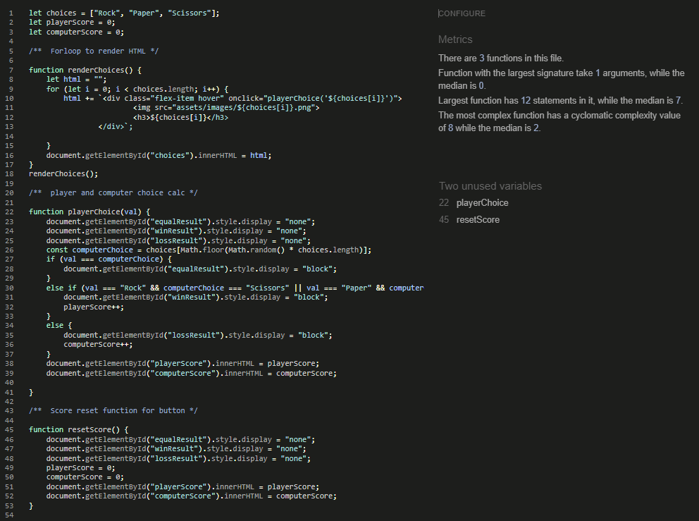

# Rock, Paper, Scissors

 Rock, Paper, Scissors is a site where you can play the game with the same name and challenge a computer. A place for people to casually drop by for a few rounds. Perfect for when your are on your way to work or during a break.

# Features

* ## Header
  

Shows the user that they have entered a site to play the game Rock, Paper, Scissors.

* ## Instruction 
 

Indicates to the user that they should make a choice by picking one option of the selections below.

* ## Game area:
 

This area is where the user plays the game. It shows the options of Paper, Rock and Scissor. After a move is made the computer will follow with its choice. Depending on the result a message will be displayed above wich indicates a win,loss or draw.

* ## Score Board:
 

This shows the standings between the player and the computer, it gets updated after every round.

* ## Rules:
 

Here is the rules of the game if needed, shown to the player so they know what wins aginst what.

# Testing

* ## Validations
 

* ### **HTML**
  
<ol>No errors found when running the code through the W3C validator.
 https://validator.w3.org/nu/?doc=https%3A%2F%2Fcashy91.github.io%2FRock-Paper-Scissors%2F </ol>
 

* ### **CSS:** 
<ol>No errors found when running the code through the Jigsaw validator.
   https://jigsaw.w3.org/css-validator/validator?uri=https%3A%2F%2Fcashy91.github.io%2FRock-Paper-Scissors%2F&profile=css3svg&usermedium=all&warning=1&vextwarning=&lang=sv </ol>

* ### **Javascript:**
  

<ol> No errors found when running the code through the Jshint validator.

 

 </ol>

## **Browser Testing**
 

* ### **Google Chrome**
 

Tested with Chrome developer tools for

 Mobile large (425px) 
 Tablet (768px)
 Laptop Large (1440px)

 

* ### Mozrilla Firefox
 

Tested with Firefox developer tools for

 iphone 12/13 
 ipad Air
 Laptop with HiDPI screen
 Desktop mode

 

* ### **Microsoft Edge**
 

Tested with Microsoft Edge developer tools for 

 Samsung Galaxy S8+
 Ipad Mini
 Laptop L (1440px)
 Desktop mode

 

## **Function testing**
 

###  **Hover over images**
 
1. When the user hover over the image of rock,paper or scissor the image currently hovered should get a black border around it.
 2. When the mouse is removed from the image the border should disappear.

 

### **Selecting a image**
 
1. When the user clicks on a image the computer should get a random choice.
 2. Text should apear about the images with a message indicating if the round is a win,draw or loss.
 3. The scoreboard below should be updated accordingly. 
 4. When the user makes a new choice the round text from the last choice above the images should be replaced by a new one.

 

### **Reseting the score**
 
1. If no round of the game has been played nothing will happend when the RESET SCORE button it clicked.
 2. When the the user clicks on the button below the scoreboard
the scorebord should be reset to 0-0.
 3. If the user have played any round when the button is clicked the result text above the images should dissapear.

 

# Deployment on Github

 1. Open the correct repository.
 2. Select settings in the menu.
 3. Click on the pages section in the side menu.
 4. Go down to Branch and select main in the dropdown.
 5. Save the changes and wait for a link that should apear at the top of the screen under Github Pages. Letting you know that the page is live.
(If nothing has happened after a few minutes refresh the page and the link should apear.)

 

# Credits

 The image was taken and then edited to fit my project. 
https://stackcodify.com/2021/06/rock-paper-scissors-in-the-dom/

  The font was taken from Googlefonts 
https://fonts.googleapis.com/css2?family=Raleway:wght@400;700&display=swap

 Color palette was generated using https://coolors.co/image-picker 
/* CSS HEX */
--black: #090909ff;
--white: #FFFFFFff;
--sunglow: #FFC73Dff;
#D48C07ff;

 Extra credit to my mentor for helping with planning and giving great feedback to help the project through its roughpatches.

    
    

    
    
