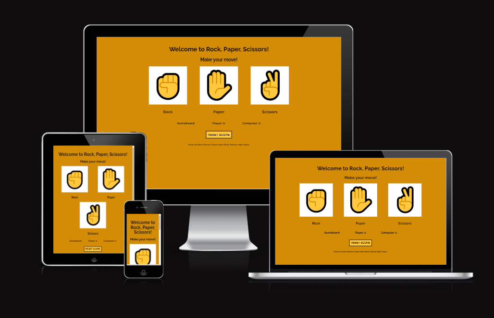
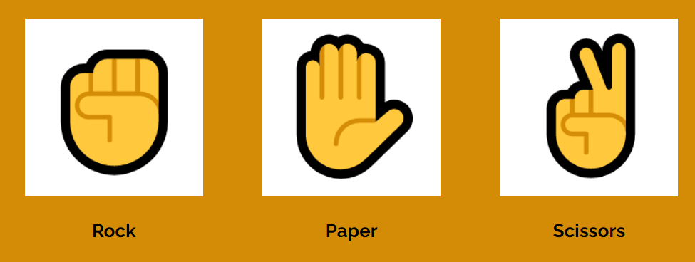
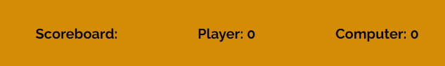
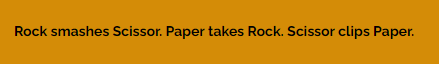

<h1>Rock, Paper, Scissors</h1>

 Rock, Paper, Scissors is a site where you can play the game with the same name and challenge a computer. A place for people to casually drop by for a few rounds. Perfect for when your on your way to work or during a break.

 
<h1>Features</h1>

Header: 

Shows the user that they have entered a site to play Rock, Paper, Scissors.

Instruction:

Indicates to the user what is expected of them to do to move forward in the game.

Game area:

This area is where the user plays the game. It shows the options of Paper, Rock and Scissor. After a move is made the computer will follow with its choice.

Score Board:

This shows the standings between the player and the computer, it gets updated after every round.

Rules:

Here is the rules of the game shown to the player so they know what wins aginst what.

    
    

    
    
